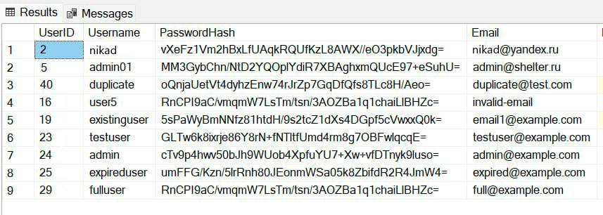
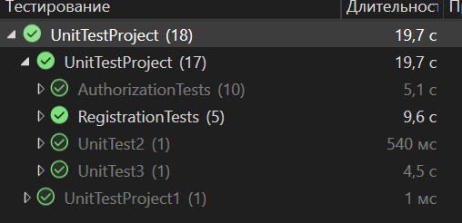

# Практическая работа №6 Создание автоматизированных Unit-тестов (Часть 2)

#### Cкриншот таблицы Microsoft SQL Server:

#### Cкриншот окна «Обозреватель тестов»:

#### Вывод: 
- Все тестовые сценарии отрабатывают корректно;
- Система корректно обрабатывает валидные и невалидные учетные данные, попытки дублирования пользователей, а также крайние случаи.
